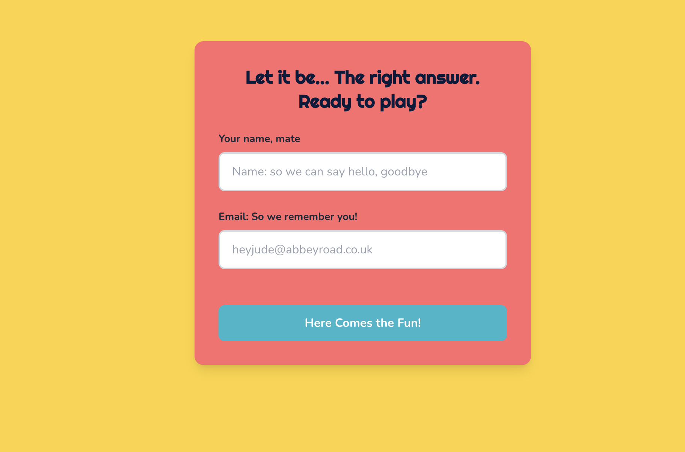
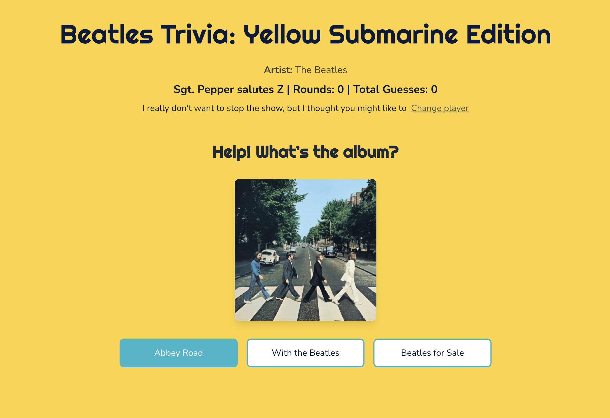
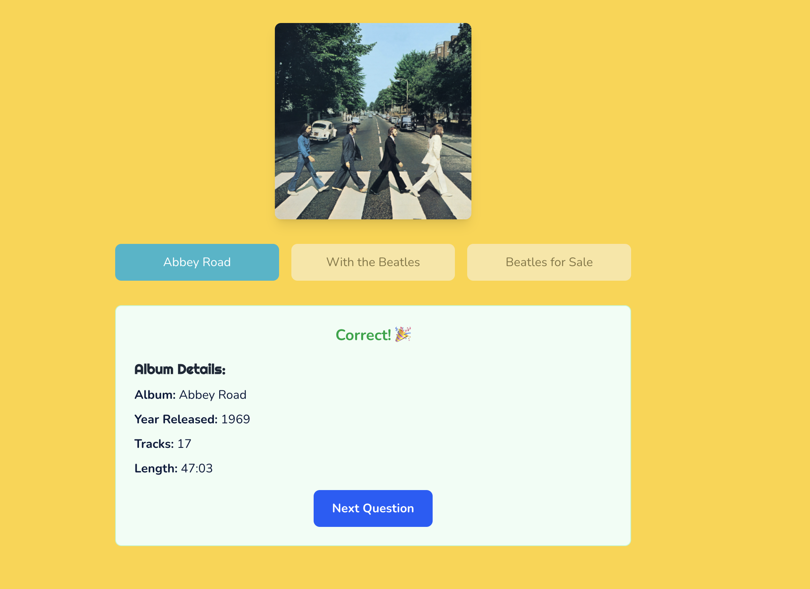

# 🎸 Beatles Trivia: Yellow Submarine Edition

A fun and interactive Beatles album trivia game built with Next.js. Test your knowledge of The Beatles' iconic albums by identifying them from their cover art!

## 📸 Screenshots

### User Registration


### Game Interface


### Album Details


## 🎵 About the App

This trivia app challenges users to identify Beatles albums from their cover images. Features include:

- **Interactive Quiz Interface**: Guess the album name from multiple choice options
- **Real-time Scoring**: Track your rounds played and total guesses
- **Beautiful Design**: Yellow Submarine themed with custom color palette and typography
- **Responsive Layout**: Works great on desktop and mobile devices
- **User Persistence**: Your user info is saved in local storage

### 🎨 Design Features

- **Color Theme**: Custom "Yellow Submarine" color palette with:
  - Primary: Submarine Yellow (#FFD335)
  - Secondary: Sea Teal (#2AB7CA)
  - Accent: Coral (#FF6B6B)
  - Background: Cloud (#F5F7FA)
  - Text: Navy (#0A1A3C)

- **Typography**: 
  - Headings: Righteous font (playful, Beatles-themed)
  - Body text: Nunito font (clean and readable)

- **Interactive Elements**: Hover effects, smooth transitions, and visual feedback

## 🚀 Getting Started

### Prerequisites

Make sure you have Node.js installed on your machine (version 16 or higher recommended).

### Installation

1. **Clone the repository**
   ```bash
   git clone <repository-url>
   cd beatles-trivia
   ```

2. **Install dependencies**
   ```bash
   npm install
   ```

3. **Set up environment variables**
   Create a `.env.local` file in the root directory and add:
   ```bash
   API_BASE_URL=""
   NEXT_PUBLIC_API_BASE_URL=""
   ```

### Running the App

1. **Start the development server**
   ```bash
   npm run dev
   ```

2. **Open your browser**
   Navigate to [http://localhost:3000](http://localhost:3000) (or the port shown in your terminal)

3. **Start playing!**
   - Enter your name and email
   - Start guessing Beatles albums
   - Track your progress with the scoring system

## 🛠️ Built With

- **[Next.js 15](https://nextjs.org/)** - React framework with App Router
- **[React 19](https://react.dev/)** - UI library
- **[TypeScript](https://www.typescriptlang.org/)** - Type safety
- **[Tailwind CSS v4](https://tailwindcss.com/)** - Utility-first CSS framework
- **[Google Fonts](https://fonts.google.com/)** - Righteous and Nunito fonts
- **[ESLint](https://eslint.org/)** - Code linting and formatting

## 📁 Project Structure

```
src/
├── app/
│   ├── components/         # React components
│   │   ├── AlbumCard.tsx  # Album cover display
│   │   ├── ClientWrapper.tsx # Client-side wrapper
│   │   ├── Trivia.tsx     # Main game component
│   │   └── UserForm.tsx   # User registration form
│   ├── globals.css        # Global styles and color variables
│   ├── layout.tsx         # Root layout with fonts
│   ├── page.tsx          # Home page
│   └── types.ts          # TypeScript type definitions
├── utils/
│   └── api.ts            # API functions
└── ...
```


**Come together, right now, and test your Beatles knowledge!** 🎸✨